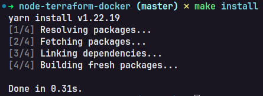
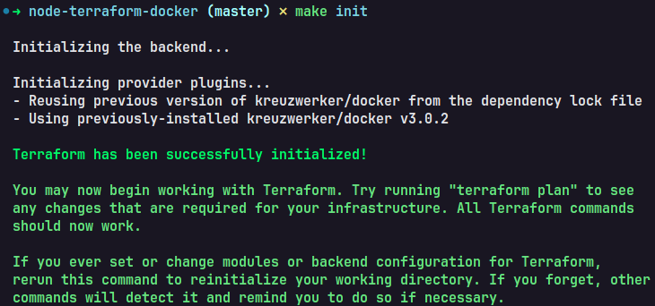
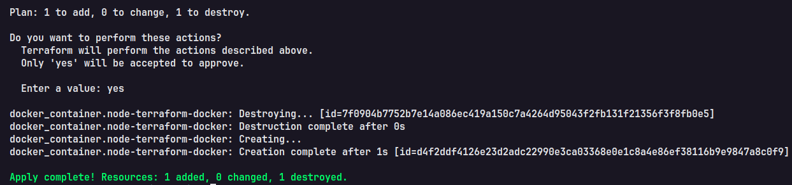
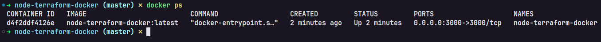
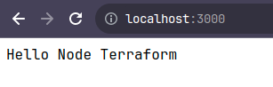

# Node Terraform Docker

- required `node`, `terraform` and `docker`

### Running all local

- Let's use the make command to run our commands

## Steps:

1 - run `make install`

#### output:



2 - run `make init`

#### output:



3 - run `make apply`

#### output:



4 - run `docker ps`

#### output:



5 - access `http://localhost:3000`

#### output:



## Node, Terraform and Docker ready to use

Example of `Makefile`

```make
#!make
MAKEFLAGS += --silent

install:
	yarn install

build:
	docker build -t node-terraform-docker .

init:
	terraform init

apply:
	terraform apply
```
